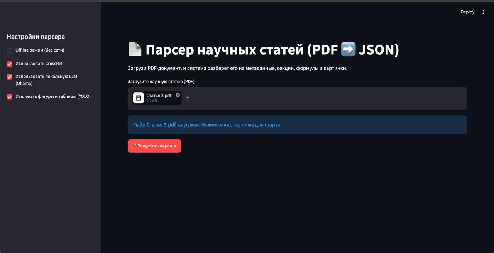
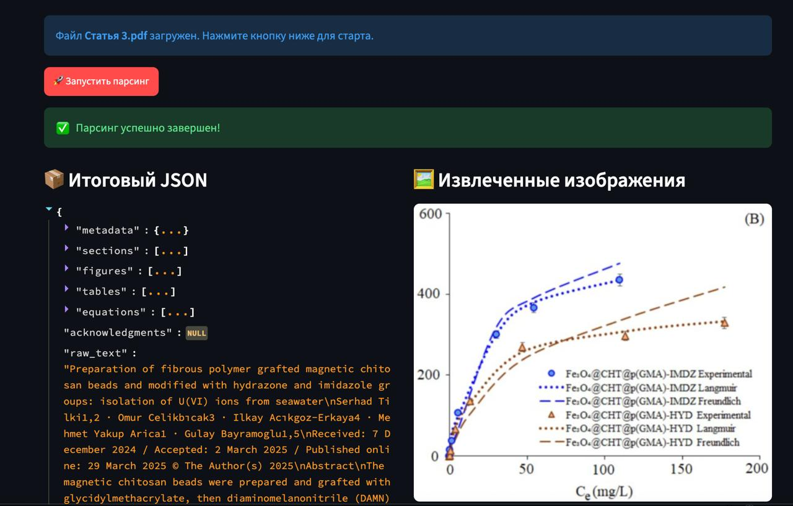
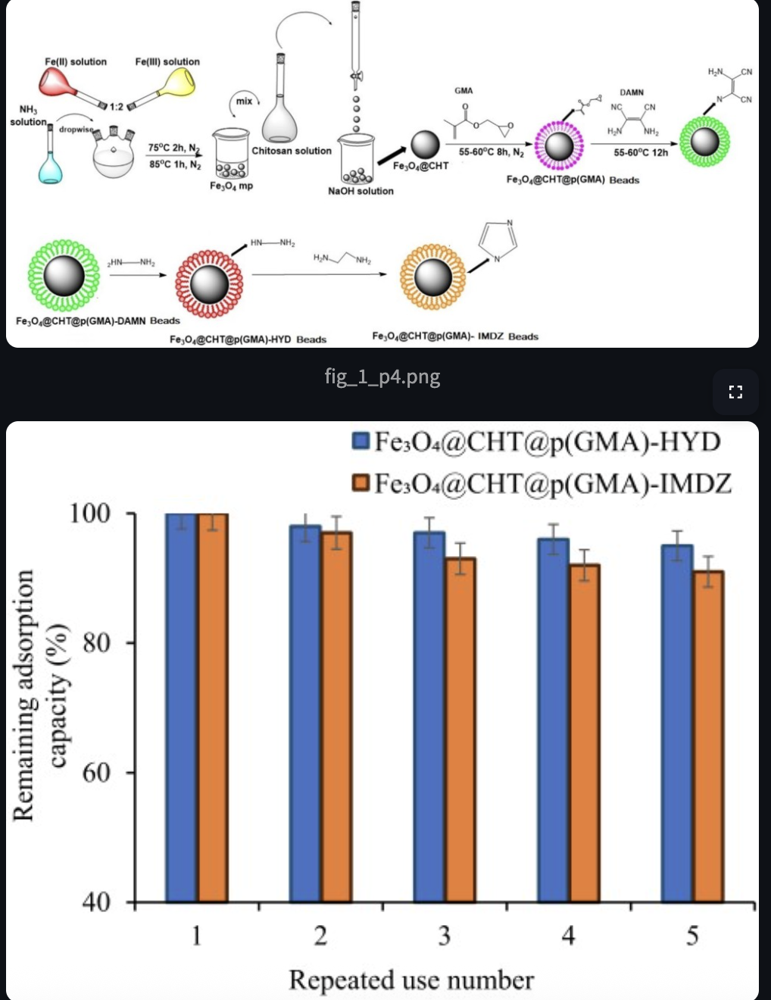

# 📄 PDF → JSON: Парсер научных статей по химии


CLI-инструмент и Web-интерфейс для пакетного извлечения структурированных данных из научных
PDF-статей (химия) в строгий машиночитаемый **JSON по схеме ТЗ**. Батч-обработка ~100 документов,
кросс-платформенность (Linux / macOS / Windows), Python ≥ 3.10.

Основные объекты извлечения:
* **Метаданные** — заголовок, авторы, DOI, год, журнал, аннотация, ключевые слова.
* **Секции** — иерархическое дерево разделов и подзаголовков.
* **Фигуры** — координаты, изображения, подписи и ID.
* **Таблицы** — кропы, подписи и распознанные данные в виде 2D-таблицы.
* **Уравнения** — LaTeX, номер, координаты и контекст.
* **Полный текст** документа.

Готовые демонстрационные прогоны — в папке [`examples/`](examples/).

---

## ✨ Что умеет

* Три режима работы: онлайн через CrossRef, оффлайн с локальной LLM и оффлайн без нейросетей.
* **Сеть включена по умолчанию** (CrossRef + LLM); полностью отключается флагом `--offline`.
* OCR-поддержка для PDF без текстового слоя (Tesseract, `eng+rus`).
* Параллельная пакетная обработка через `--workers`.
* Логирование статуса по каждому документу + итоговая сводка (stdout и `run.log`).
* Идемпотентность: повторный запуск пропускает уже обработанные файлы.
* Строгие Pydantic-схемы — гарантированно валидный JSON.
* Метрики качества: Precision / Recall / F1 на отложенной выборке.

---

## 🏗 Архитектура

| Файл | Назначение |
| --- | --- |
| `src/parser/cli.py` | CLI на Typer: аргументы, режимы, логирование |
| `src/parser/pipeline.py` | Оркестратор: полный цикл обработки + статусы/сводка |
| `src/parser/schemas.py` | Pydantic-схемы итогового JSON (стандарт данных) |
| `src/parser/extractor.py` | Извлечение текста с учётом колонок (PyMuPDF) |
| `src/parser/ocr.py` | OCR-фоллбэк для сканов (Tesseract) |
| `src/parser/metadata.py` | Каскад метаданных: DOI → CrossRef → LLM → эвристики |
| `src/parser/sections.py` | Построение дерева секций |
| `src/parser/figures.py` | Фигуры/таблицы (DocLayout-YOLO + VLM) |
| `src/parser/equations.py` | Уравнения (YOLO + Pix2Tex → LaTeX) |
| `src/parser/evaluation.py` | Метрики качества precision/recall/F1 |

---

## 🚀 Быстрый старт с Docker и Streamlit

Лучший способ быстро запустить проект без локальной установки библиотек.
**Для Windows особенно рекомендуется** — Docker уже содержит все системные пакеты.

### 1. Установите Ollama
Проект использует локальные модели Ollama для метаданных и распознавания таблиц.

```bash
ollama run qwen2.5:3b  # метаданные
ollama run llava       # таблицы
```

### 2. Запустите контейнер

```bash
git clone https://github.com/mihaillogger/pdf-to-json-parser.git
cd pdf-to-json-parser

docker-compose up --build -d
```

Web-интерфейс: **http://localhost:8501**.
Контейнер автоматически пробрасывает доступ к локальной Ollama через `host.docker.internal`.

---

## 💻 Локальная установка и запуск

### Требования

* **Python 3.10–3.12** (на 3.13+ часть ML-зависимостей не имеет колёс).
* **[uv](https://docs.astral.sh/uv/)** — менеджер зависимостей и окружения.
* Системные пакеты: **Tesseract** (OCR), **Poppler** (нарезка PDF), **Ghostscript** (таблицы, Camelot), **libgl1** (OpenCV).

#### Linux (Debian/Ubuntu / WSL)

```bash
sudo apt update && sudo apt install -y \
  tesseract-ocr tesseract-ocr-eng tesseract-ocr-rus \
  ghostscript poppler-utils libgl1 libglib2.0-0
```

#### macOS

```bash
brew install tesseract tesseract-lang ghostscript poppler
```

#### Windows (локальный запуск без Docker)

В отличие от UNIX-систем, на Windows утилиты ставятся вручную:

1. **Tesseract OCR** — [скачать установщик](https://github.com/UB-Mannheim/tesseract/wiki). При установке **обязательно выбрать русский язык**.
2. **Ghostscript** — [скачать релиз](https://www.ghostscript.com/releases/gsdnld.html).
3. **Poppler** — [скачать](https://github.com/oschwartz10612/poppler-windows/releases), распаковать (например, в `C:\poppler`) и добавить `C:\poppler\Library\bin` в системную переменную `PATH`.

> 💡 **Рекомендация для Windows:** чтобы не настраивать пакеты вручную — запускайте через **Docker**.

### Установка зависимостей

```bash
uv sync          # поднимет .venv и поставит зависимости строго по uv.lock
```

> Зависимости меняются только через `uv add <пакет>`; `uv.lock` коммитится.

### Запуск CLI

```bash
# одиночный файл
uv run python -m parser --input article.pdf --output out/

# целая директория, 4 параллельных воркера
uv run python -m parser --input ./pdfs --output out/ --workers 4
```

### Основные флаги

| Флаг | По умолчанию | Описание |
| --- | --- | --- |
| `--input` | — | PDF-файл или директория с PDF |
| `--output` | — | Каталог для JSON, изображений и `run.log` |
| `--workers` | `1` | Число параллельных процессов для батча |
| `--overwrite` | off | Перезаписывать уже существующие JSON |
| `--log-level` | `INFO` | Уровень логов (`INFO` / `DEBUG`) |
| `--extract-images` | on | Извлекать фигуры/таблицы (YOLO + VLM) |
| `--offline` | off | Не обращаться к внешним сервисам (CrossRef); локальная LLM остаётся доступной |
| `--crossref / --no-crossref` | on | Использовать CrossRef API для метаданных |
| `--llm / --no-llm` | on | Использовать локальную LLM (Ollama) |

### Режимы работы

> По умолчанию сеть **включена** (CrossRef + LLM). Флаги ниже её ограничивают.

| Режим | Команда | Что использует |
| --- | --- | --- |
| **Онлайн** | *(по умолчанию)* | CrossRef по DOI — максимальное качество метаданных |
| **Офлайн + LLM** | `--offline` | Локальная модель через Ollama, без обращения к интернету |
| **Офлайн без LLM** | `--offline --no-llm` | Только эвристики, полностью автономно |

**Локальная LLM (Ollama).** Адрес и модель настраиваются переменными окружения (важно для Docker):

| Переменная | По умолчанию | Назначение |
| --- | --- | --- |
| `OLLAMA_URL` | `http://localhost:11434/api/chat` | Эндпоинт LLM для метаданных |
| `OLLAMA_MODEL` | `qwen2.5:3b` | Модель для метаданных |
| `OLLAMA_HOST` | `http://localhost:11434` | Хост Ollama для VLM-таблиц (`llava`) |

**Провайдер и стоимость (ТЗ 6.7):** все модели локальные, через **[Ollama](https://ollama.com)** —
`qwen2.5:3b` (метаданные) и `llava` (таблицы). Внешние платные API не вызываются,
данные не покидают машину, **стоимость обработки одного документа — $0**.

---

## 📊 Что на выходе

На каждый `<имя>.pdf` создаётся `<имя>.json` (объект `Document`), кропы фигур/таблиц
в `out/images/<имя>/`, а также общий `out/run.log`. Живые примеры — в [`examples/`](examples/).

```jsonc
{
  "metadata": {
    "title": "...", "title_en": null, "authors": ["Фамилия, И."],
    "abstract": "...", "keywords": [], "doi": "10.1039/...",
    "journal": "...", "year": 2023,
    "metadata_source": "crossref", "metadata_confidence": 0.95
  },
  "sections":  [{ "heading": "Introduction", "level": 1, "content": "...",
                  "subsections": [], "number": "1" }],
  "figures":   [{ "id": "Figure 1", "caption": "...", "page": 2,
                  "bbox": {}, "img_path": "images/.../fig_1_p2.png" }],
  "tables":    [{ "id": "Table 1", "caption": "...", "data": [["..."]] }],
  "equations": [{ "id": "(1)", "latex": "E = mc^2", "context": "..." }],
  "acknowledgments": null,
  "raw_text": "полный текст документа"
}
```

---

## 🎬 Демонстрация работы

### Лог пакетной обработки

Статус по каждому документу + итоговая сводка пишутся в stdout и в `run.log`
(реальный прогон из [`examples/`](examples/), онлайн-режим):

```text
2026-06-09 21:19:03 | INFO     | Запуск парсера. Вход: ./pdfs
2026-06-09 21:19:03 | INFO     | Параметры: workers=1, overwrite=False, extract_images=True
2026-06-09 21:19:03 | INFO     | Режимы работы: offline=False, use_crossref=True, use_llm=True
2026-06-09 21:19:03 | INFO     | Найдено файлов: 2. Запуск 1 воркеров.
2026-06-09 21:45:10 | SUCCESS  | [OK] Статья 3.pdf (812.7s)
2026-06-09 22:18:32 | WARNING  | [ЧАСТИЧНО] c2tc00123c.pdf (1188.9s) — пустые поля: abstract
2026-06-09 22:18:32 | INFO     | ============================================================
2026-06-09 22:18:32 | INFO     | ИТОГ: всего=2, успешно=1, частично=1, ошибок=0, пропущено=0
2026-06-09 22:18:32 | INFO     | Время: общее=2001.6s, среднее/документ=1000.8s
2026-06-09 22:18:32 | INFO     | ============================================================
```

### Пример извлечённой фигуры

Кроп фигуры, автоматически вырезанный детектором (DocLayout-YOLO) с привязанной
подписью «Fig. 4 VSM profiles …» из статьи `Статья 3` (Springer):


> Все кропы и соответствующие им `bbox`/`caption`/`id` — в [`examples/`](examples/).

### Веб-интерфейс (Streamlit)

Загрузка PDF и просмотр результата в браузере (`docker-compose up` → http://localhost:8501):

**Стартовый экран (загрузка PDF):**



**Итоговый JSON по схеме ТЗ:**



**Извлечённые фигуры:**



---

## 📈 Оценка качества

Метрики precision / recall / F1 — сравнением вывода парсера с эталоном `evaluation/gold.json`.
Детали — в [`evaluation/README.md`](evaluation/README.md).

### Что такое `gold.json` (эталонная разметка)

Чтобы измерить качество, нужны «правильные ответы», с которыми сравнивается вывод парсера —
это и есть `gold.json` («золотой стандарт»). Для каждой статьи записано, что парсер **должен**
был извлечь:

```jsonc
{
  "d2cs00172a.pdf": {                       // имя файла-статьи
    "title": "Reactive oxygen species...",  // правильное название
    "authors": ["Wang, Li", "Chen, X."],    // правильные авторы
    "doi": "10.1039/d2cs00172a",
    "year": 2023,
    "journal": "Chemical Society Reviews",
    "abstract": "Oxidative stress is..."     // правильная аннотация
  }
}
```

Скрипт метрик: (1) прогоняет парсер по PDF, (2) сравнивает ответ с эталоном, (3) считает
precision/recall/F1. Эталон берётся из **CrossRef по DOI** + ручная проверка — сравнение
идёт с независимым источником истины. Это «отложенная выборка» (held-out set) из ТЗ.

### Запуск

```bash
# метрики по метаданным (извлечение «на лету»)
uv run python scripts/eval_metadata.py --input ./pdfs --mode offline

# метрики по полному выходу пайплайна (Document-JSON)
uv run python -m parser --input ./pdfs --output out/
uv run python scripts/eval_pipeline.py --pred-dir out/ --gold evaluation/gold.json
```

### Краткий отчёт о результатах

Отложенная выборка из 3 статей разных издателей (Elsevier, RSC, Springer).

**offline (только эвристики, без сети и LLM):**

| поле     | precision | recall | f1    | support |
| --- | --- | --- | --- | --- |
| title    | 1.000     | 1.000  | 1.000 | 3       |
| doi      | 1.000     | 1.000  | 1.000 | 3       |
| year     | 1.000     | 1.000  | 1.000 | 3       |
| authors  | 0.952     | 0.675  | 0.714 | 3       |
| abstract | 1.000     | 0.500  | 0.667 | 2       |
| journal  | 0.000     | 0.000  | 0.000 | 3       |

**online (CrossRef):** все поля — 1.000 (верхняя граница качества).

**Среднее время обработки:** ~0.5 с/документ для текста и метаданных в оффлайн-режиме.
Полное извлечение с фигурами/таблицами/уравнениями тяжелее и зависит от наличия GPU и
локальных моделей (на CPU-прогоне примеров — порядка 10–25 мин/документ из-за VLM по таблицам).

---

## 🧩 Использованные библиотеки и модели

| Библиотека | Версия | Назначение |
| --- | --- | --- |
| PyMuPDF (fitz) | 1.27 | извлечение текста и рендер страниц |
| pydantic | 2.13 | схемы и валидация JSON |
| typer | 0.25 | CLI |
| loguru | 0.7 | логирование |
| httpx | 0.28 | запросы к CrossRef / LLM |
| pytesseract | 0.3 | OCR-фоллбэк (Tesseract) |
| camelot-py | 2.0 | вспомогательное извлечение таблиц |
| ultralytics | 8.4 | YOLOv8 (детекция уравнений) |
| doclayout-yolo | 0.0.4 | DocLayout-YOLO (детекция фигур/таблиц) |
| pix2tex | 0.1 | распознавание формул в LaTeX |
| ollama | 0.6 | клиент локальных моделей |
| streamlit | — | веб-интерфейс |

**Модели (все локальные):** `qwen2.5:3b` и `llava` через Ollama, DocLayout-YOLO и кастомная
YOLOv8 для формул, Pix2Tex (LaTeX-OCR), Tesseract (`eng+rus`).

---

## ⚠️ Известные ограничения

Оценки ниже подтверждены на демонстрационных прогонах из [`examples/`](examples/).

* **Таблицы (содержимое).** Детекция таблиц и кропы работают надёжно, но распознавание в
  2D-массив (`data`) через VLM `llava` срабатывает редко: на примерах удалось распарсить
  лишь ~1 таблицу из 14 (на сложных моделях возвращает обрезанный/битый JSON → `data: []`,
  что схема ТЗ допускает). Решения: запуск VLM на GPU и переход на более сильную
  мультимодальную модель (например, `qwen2-vl`).
* **Уравнения (нумерация и охват).** Кастомная YOLOv8 уверенно детектирует классические
  блочные уравнения `(1)`, но нестандартную журнальную нумерацию (например, `(eqn 1)`) может
  пропускать — таких примеров не было в обучающей выборке. Изредка попадается шумный crop.
  Решается расширением датасета.
* **abstract у части издателей.** На статьях, где abstract не лежит в CrossRef и плохо
  отделяется эвристикой (часть ACS/RSC), поле остаётся пустым (статус «частичный успех»).
* **authors.** Высокая точность, но неполный recall на «склеенных» байлайнах некоторых
  издателей (буквы аффилиаций липнут к именам).
* **keywords.** Редко присутствуют в CrossRef и не извлекаются эвристикой — обычно `[]`.
* **Иерархия секций.** Уровни вычисляются по нумерации и размеру шрифта; на нетиповой
  вёрстке весь документ может оказаться под одним корневым заголовком.

---

## 👥 Команда

| Участник | Зона ответственности |
| --- | --- |
| **Матвей Ильенков** | `extractor.py`: извлечение текста, обработка колонок, зонирование |
| **Роман Корняков** | `sections.py`: дерево секций, Docker-инфраструктура, Web-интерфейс |
| **Арсений Фёдоров** | `figures.py`, `equations.py`: детекция фигур/таблиц/уравнений |
| **Михаил Позин** | `pipeline.py`, `cli.py`: архитектура пайплайна, CLI, интеграция CI/CD |
| **Арсений Бобченок** | `metadata.py`, `ocr.py`, `evaluation.py`: каскад DOI/CrossRef/LLM, OCR-фоллбэк, метрики качества |
